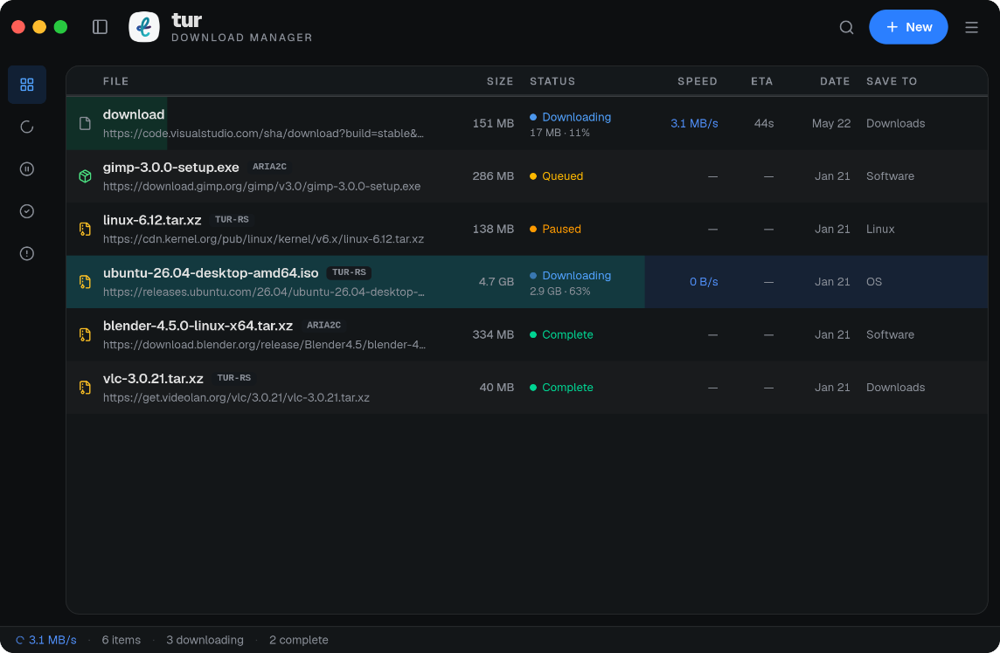
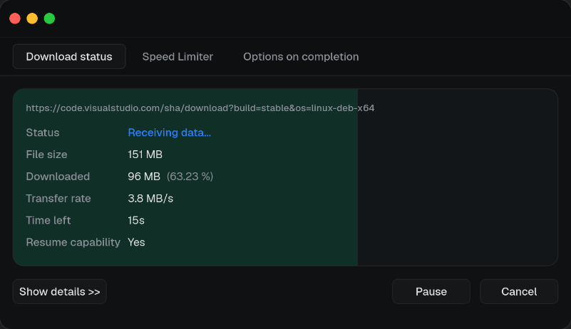

<div align="center">
  
  <h1>Tur</h1>
  <p><strong>A sleek, highly concurrent, multi-engine download manager.</strong></p>

  <p>
    <a href="https://github.com/greykaizen/tur-tauri/releases"></a>
    <a href="https://github.com/greykaizen/tur-tauri/actions"></a>
    <a href="https://github.com/greykaizen/tur-tauri/blob/main/LICENSE"></a>
  </p>
</div>

---

**Tur** is the native graphical frontend for the hyper-fast download engine [tur-rs](https://github.com/greykaizen/tur-rs). Built using **Tauri**, **React**, and **TypeScript**, it delivers a stunning, responsive, and native-feeling interface across all major operating systems while keeping memory and CPU usage at an absolute minimum.

Say goodbye to bloated, ad-filled download managers. Tur is fully open-source, designed for power users, and unapologetically fast.

## ✨ Features

- ⚡ **Hyper-Fast Core**: Powered by the native Rust `tur-rs` backend, featuring adaptive work-stealing and highly concurrent multi-connection downloading.
- 🎨 **Gorgeous Interface**: A modern, translucent, glassmorphism-inspired UI designed for both aesthetics and usability.
- 🔌 **Multi-Engine Support**: Not just a frontend for `tur-rs`—Tur architecture allows plugging in external engines like `aria2c` seamlessly.
- 💾 **Smart Persistence**: Download sessions, histories, and configurations are securely stored using a blazing-fast local SQLite database.
- 🌍 **Cross-Platform Native**: First-class support for Linux, Windows, and macOS without the heavy Electron overhead.

## 📸 Screenshots

<div align="center">
  
  <br />
  
  <p><em>Detailed download instance view with real-time speed and progress tracking.</em></p>
</div>

## 🚀 Installation

You can always find the latest pre-compiled binaries on the [Releases](https://github.com/greykaizen/tur-tauri/releases) page.

### 🐧 Linux
- **Fedora (COPR)**: Officially published on Fedora COPR! Install it effortlessly:
  ```bash
  sudo dnf copr enable greykaizen/tur
  sudo dnf install tur-tauri
  ```
- **Arch Linux (AUR)**: Officially published on the AUR! Install it instantly using any AUR helper: `yay -S tur-tauri` or `paru -S tur-tauri`
- **AppImage / .deb / .rpm**: Download directly from the Releases page.

### 🪟 Windows
- Download the `.msi` or `.exe` installer, run the setup, and you're good to go.

### 🍏 macOS
- Download the `.dmg` file, open it, and drag **Tur** into your Applications folder.

## 🗺️ Roadmap

We are constantly working on improving Tur. Here is what we are planning next:

- [ ] **Flathub Release**: Official publishing to Flathub for seamless Linux installs.
- [ ] **Browser Extensions**: Chrome/Firefox extensions to automatically intercept file downloads.
- [ ] **Category Management**: Auto-categorize downloads (Videos, Music, Documents, etc.).
- [ ] **Scheduling**: Allow pausing/resuming downloads on a specific schedule.
- [ ] **More Engines**: First-class UI integration for `aria2c` configurations.

## 🛠️ Development & Contributing

Want to help make Tur even better? We'd love your contributions!

### Prerequisites
- [Node.js](https://nodejs.org/) and [Bun](https://bun.sh/)
- [Rust](https://www.rust-lang.org/tools/install)

### Running Locally

```bash
# Clone the repository
git clone https://github.com/greykaizen/tur-tauri.git
cd tur-tauri

# Install frontend dependencies
bun install

# Run the app in development mode
bun run tauri dev
```

Please feel free to open **Issues** or submit **Pull Requests**. Make sure to follow the existing code style and write descriptive commit messages.

## 💬 Support

If you encounter any bugs, have a feature request, or just want to ask a question:
- Please open an issue on the [GitHub Issues](https://github.com/greykaizen/tur-tauri/issues) page.
- We welcome community discussions!

## 📜 License

Tur is completely free and open-source software licensed under the **GNU General Public License v3.0**. See the [LICENSE](LICENSE) file for more details.
